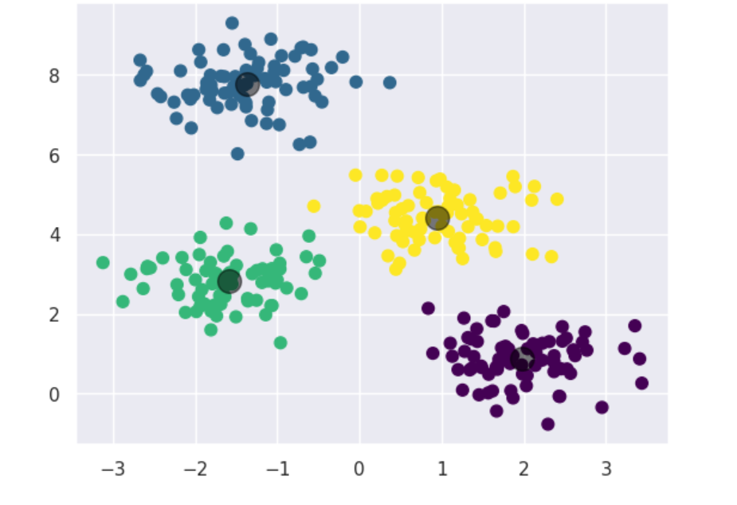

# Cancer_Prediction
# 🧠 Cancer Prediction using AI/ML

This project uses **Machine Learning** techniques to predict the likelihood of cancer based on patient data. It leverages popular Python libraries like **pandas**, **scikit-learn**, and **matplotlib**, and is built with a focus on accuracy, usability, and interpretability.

## 📌 Overview

- 📊 Input: Patient diagnostic data (e.g., tumor size, texture, radius)
- 🔍 Output: Binary classification (Benign / Malignant)
- 🧪 Techniques: Data preprocessing, feature selection, model training, evaluation
- 🤖 Algorithms: Logistic Regression, SVM, Decision Tree, Random Forest, KNN

## 🛠 Tech Stack

- Language: Python
- Libraries: `pandas`, `numpy`, `matplotlib`, `seaborn`, `scikit-learn`, `joblib`
- Tools: Jupyter Notebook / Google Colab

## Screenshot

